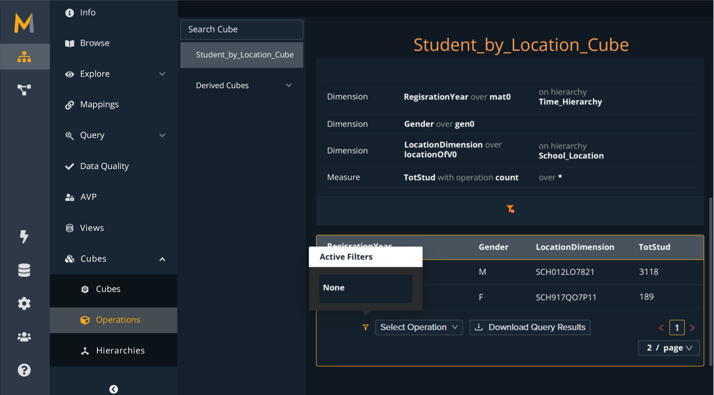
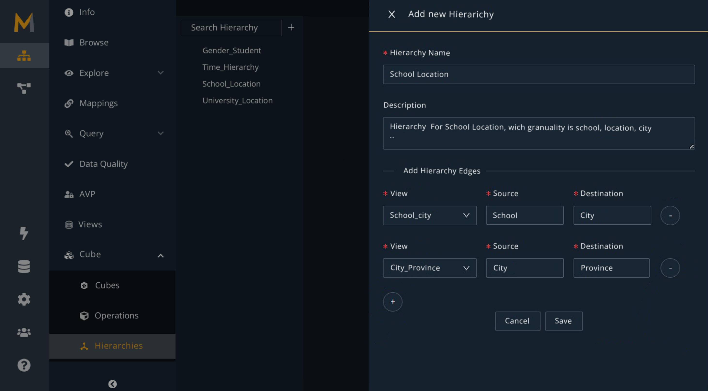

# Enriching Ontology-based Data Management with Multidimensional Modeling

**Supplementary Material**

This repository accompanies the paper *"Enriching Ontology-based Data Management with Multidimensional Modeling"*. It provides supplementary material, including implementation details and a detailed running example, which expands and clarifies the concepts introduced in the paper.

## Overview

This work extends the traditional Ontology-Based Data Management (OBDM) paradigm by introducing a formal framework for modeling and reasoning over multidimensional data. Our framework integrates cubes, hierarchies, and views as intentional, ontologically grounded objects, and supports reasoning services such as:

- Cube and hierarchy coherence
- Intentional aggregation
- Holistic query answering that spans both analytical and domain-level data

We implemented the Multi-OBDM framework by extending an existing mature and production-grade Ontology-Based Data Management (OBDM) system. The system supports the core principles of the OBDM paradigm, relying on semantic standards such as OWL for ontology specification and SPARQL as the query language. Mappings between the ontology and the underlying relational sources are defined using either a proprietary XML-based syntax or the W3C-standard R2RML language.

The examples presented in the previous sections, including views, hierarchies, and base/derived data cubes, are drawn from a broader case study involving the integration and aggregation of school attendance data from multiple countries. This scenario illustrates how OLAP operations can be semantically modeled and executed over integrated data sources using the Multi-OBDM approach.

To support the creation and exploration of multidimensional artifacts, we extended the system's user interface with dedicated graphical components. Users can specify views using an embedded SPARQL editor, define hierarchies and data cubes through dropdown-based forms, apply filters to cube dimensions, and visualize the aggregated results directly from the interface.

## Implementation (Backend)

The framework has been implemented as an extension of the [Mastro](https://obdasystems.com) OBDM system. Mastro supports OWL ontologies, SPARQL queries, and R2RML or XML-based mapping definitions.

## User Interface

We enhanced the **Monolith** interface (the user-facing component of Mastro) with support for multidimensional constructs:

- Graphical editors for views, hierarchies, and cubes
- Drop-down menus and SPARQL editors for defining cube logic
- Interactive filtering and data slicing
- Visual feedback on cube aggregation results

  

  

## Repository Contents

- `figures/`: UI screenshots
- `backend/`: Java BackendCode
- `frontend/`: UI Code
- `README.md`: This document

